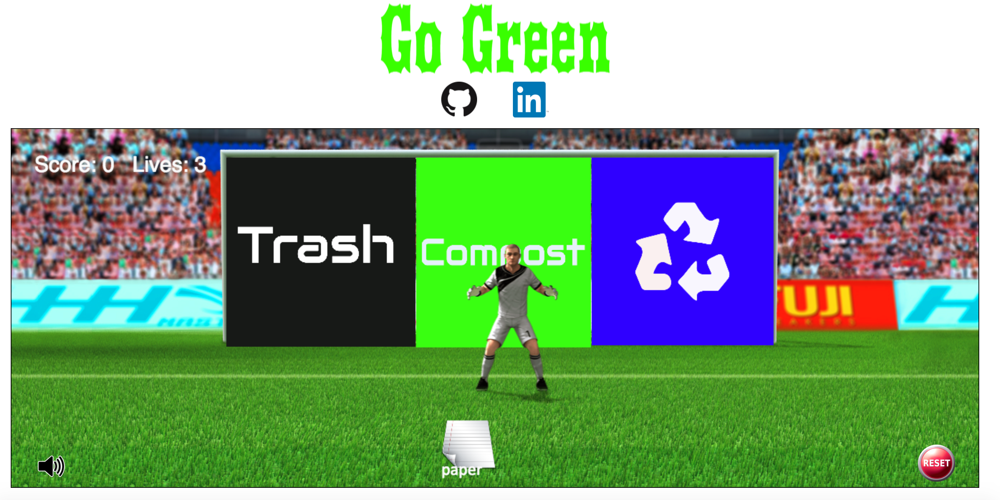

#Go Green

[Go Green Link](https://huijunyam.github.io/GoGreen/)



##Background
Go Green is an educational game that teaches people how to sort and recycle the trash correctly. The game is designed based on the soccer game theme. There will be three bins labeled as trash, compost, and recycle setting up in front of the player. The users will use keypad(up, down, left, right) to control and move the trash into the correct bin. A scoreboard will display the score of the player based on the correct sorted trash.  

For more information about the recyclable items, please visit this [recycle list] (https://www.buffalo.edu/recycling/recyclable.htm)

##Architecture and Technologies
Go Green is created with Javascript, HTML5, CSS3, and `howler.js`
- Vanilla Javascript for game logic and structure
- Javascript Canvas for DOM Manipulation and rendering
- `howler.js` for playing audio
- Webpack for bundling all the scripts file

##Implementation
Go Green uses the HTML Canvas to draw graphics via Javascript. It uses `requestAnimationFrame` to constantly render and update the canvas to provide animation for the game.
```
let w = window;
requestAnimationFrame = w.requestAnimationFrame || w.webkitRequestAnimationFrame ||
w.msRequestAnimationFrame || w.mozRequestAnimationFrame;
```

The splash page will be rendered when the users win or lose the game by manipulating the visibility style in CSS to visible and manipulated the DOM element by adding winning or losing messages using innerHTML tag.
```
let win = () => {
  const winSplash = document.getElementById("win-splash");
  const victory = document.getElementById("victory");
  victory.innerHTML = `You have a score of ${score + 10}`;
  winSplash.style.visibility = "visible";
  document.addEventListener("keydown", (e) => {
    if (e.keyCode === 32) {
      const winSplashMessage = document.getElementById("win-splash");
      winSplashMessage.style.visibility = "hidden";
      restart();
    }
  });
};
```

Go Green uses `howler.js` to create the sound effect if users sort the trash correctly or wrongly.
```
let savedAudio = new Howl({
  src: ['./sounds/ball_saved.mp3']
});

let goalAudio = new Howl({
  src: ['./sounds/goal.mp3']
});
```

##Future Plan
My future plan for this project include the following features:
- Randomly generated bomb that can stop the movement of goalkeeper for few seconds
- Difficulty is increased by the score of the player
- A slider that can toggle between different themes such as basketball or football (original theme)
