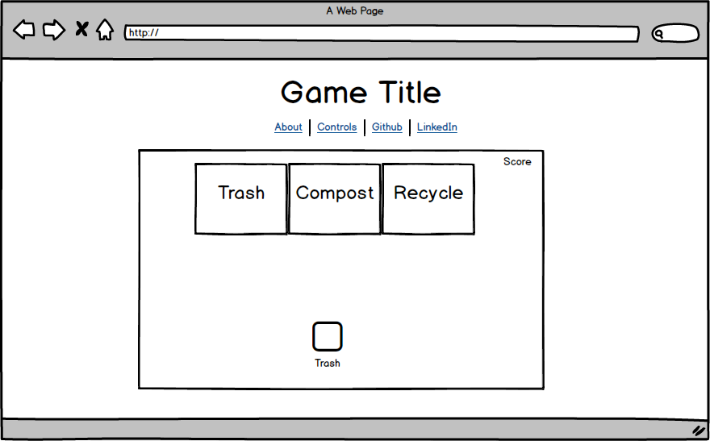

# Go Green

##Background
Go Green is an educational game that teaches people how to sort and recycle the trash correctly. The game is designed based on the soccer game theme. There will be three bins labeled as trash, compost, and recycle setting up in front of the player. The users will use keypad to control and move the trash into the correct bin. A scoreboard will display the score of the player based on the correct sorted trash.  

##Functionality & MVP
- [ ] Randomly generated trash positioned in front of player
- [ ] Player able to kick the trash to the direction set by player

In addition, this project will include:
- [ ] An About modal describing the background and rules of the game
- [ ] A production README

##Wireframes
This app will consist of a single screen with game board and nav links to the Github and LinkedIn. The About modal will show the background and rules of the game and the game controls that are required in this game.

##Architecture and Technologies
This project will be implemented with the following technologies:
- Vanilla Javascript for game logic and structure
- Javascript Canvas for DOM Manipulation and rendering
- `howler.js` for playing audio
- Webpack to bundle all the scripts file

`go_green.js`: this.script will handle all the game logic during the game play

##Implementation Timeline
**Day 1:** Setup all the necessary Node modules and get webpack up by creating `webpack.config.js` and `package.json`. Learn the basic of Canvas to render the canvas element. Complete the index.html and entry file.

**Day 2:** Setup the trash objects and able to render all types of trash into the canvas and make the trash movable. Complete all the necessary function for trash object.

**Day 3:** Setup all the game logic in `go_green.js` and handle all the key events that are necessary to play the game. Setup the score board and about modal.

**Day 4:** Install all the necessary splash page. Style the frontend of the webpage. Complete the production README

##Bonus features
- [ ] goalkeeper able to catch the trash that was kicked by player
- [ ] Randomly generated bomb that can kill the goalkeeper for few seconds
- [ ] Difficulty is increased by the score of the player
- [ ] A slider that can toggle between different themes such as basketball or football (original theme)
